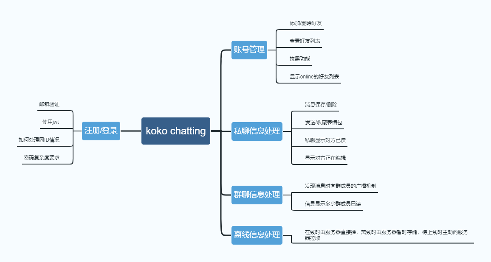

# Koko chatting

- 参会者：虎琰豪、周安东、韩博、崔裕铭、李佳穆

- 时间地点：2022年9月30日 线上会议

# 功能

- 用户的注册、登录

- 支持添加好友，删除好友，私聊

- 查看我的好友

- 显示 online 列表

- 支持收藏表情，发送表情

- 显示 xxx is editing

- 私聊时显示 ta 最近什么时候查看过对话

- 可以查看群消息、删除群消息

- 某人退群时不删除该群的消息、删好友同理

- 拉黑功能，不接受 xxx 的好友请求

- 如果对方不在，则服务器暂存消息，等对方上线再由对方向服务器拉取

- Channel

# 技术

- Redis？

- Electron：网页打包成桌面 app

- Flutter、ReactNative：如果要客户端 app 可以考虑

- Golang Gin + WebSocket or tcp?

- Vue 3 + typescript + pinia

## TODO

- MindMap：HYH

- NABCD 模型：HYH

- 墨刀原型系统构建：CYM

## 实现

## 要求

1. 注释

2. 文档

3. 统一的代码格式化

## 其他

项目原型图墨刀地址：

https://modao.cc/app/6hS8mT0Trj3q8voVeSSV4q#screen=sl8qnl2gzm15ae4

项目mindmap地址：

https://modao.cc/mind/share/Fm2hvIo8rj4ilexzi2XQM

## 思维导图

## 会议照片

